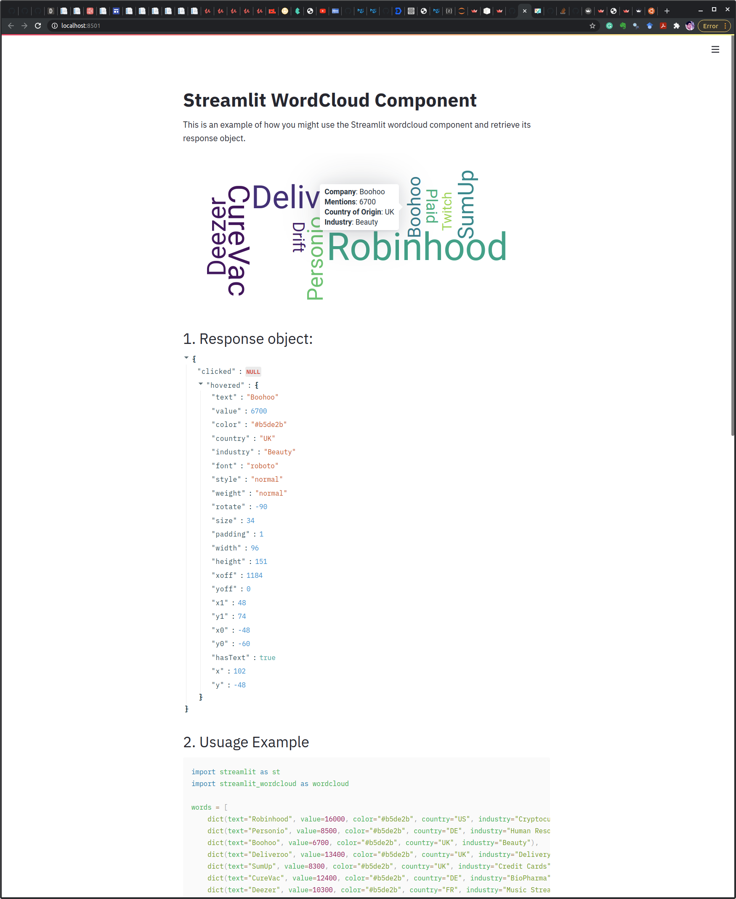

# Streamlit WordCloud Component

This is a Streamlit wrapper For [React Wordcloud](https://github.com/chrisrzhou/react-wordcloud) with some minor modifications.


## Overview

You can use this Streamlit component to create beautiful and interactive WordCloud visualization as shown in the image below. 




## Quickstart

1. Clone this repo.
2. Create a new Python virtual environment for the package to be install (Optional):
```
$ python3 -m venv .venv  # create venv
$ .venv/bin/activate   # activate venv
```
3. Install the package from PyPi
```
$ pip install streamlit-wordcloud # install streamlit wordcloud package
```
4 Run the example provided in this repo in `usage-example.py`:
```
$ streamlit run usage-example.py
```
5 Open `localhost:8501` in your browser.

6 If everything goes well you should be able to see a page similar to this:


## Examples

```python
import streamlit as st 
import streamlit_wordcloud as wordcloud

words = [
    dict(text="Robinhood", value=16000, color="#b5de2b", country="US", industry="Cryptocurrency"),
    dict(text="Personio", value=8500, color="#b5de2b", country="DE", industry="Human Resources"),
    dict(text="Boohoo", value=6700, color="#b5de2b", country="UK", industry="Beauty"),
    dict(text="Deliveroo", value=13400, color="#b5de2b", country="UK", industry="Delivery"),
    dict(text="SumUp", value=8300, color="#b5de2b", country="UK", industry="Credit Cards"),
    dict(text="CureVac", value=12400, color="#b5de2b", country="DE", industry="BioPharma"),
    dict(text="Deezer", value=10300, color="#b5de2b", country="FR", industry="Music Streaming"),
    dict(text="Eurazeo", value=31, color="#b5de2b", country="FR", industry="Asset Management"),
    dict(text="Drift", value=6000, color="#b5de2b", country="US", industry="Marketing Automation"),
    dict(text="Twitch", value=4500, color="#b5de2b", country="US", industry="Social Media"),
    dict(text="Plaid", value=5600, color="#b5de2b", country="US", industry="FinTech"),
]
return_obj = wordcloud.visualize(words, tooltip_data_fields={
    'text':'Company', 'value':'Mentions', 'country':'Country of Origin', 'industry':'Industry'
}, per_word_coloring=False)
```


## .visualize() Method Options

| Prop  | Default | Type | Description |
| :------------ | :---------------:| :---------------:| ---------------|
| words | `None` | `list[dict]` | List of word dictionaries to be used for wordcloud visualiztion. Required keys: `'text', 'value'`. Optional keys: `'color'`, `<-Any Additional Meta Key->` |
| width | `'100%'` | `str` | Width of wordcloud |
| height | `None` | `str` | Height of wordcloud |
| font_min | `None` | `int` | Smallest font size of words in wordcloud |
| font_max | `None` | `int` | Largest font size of words in wordcloud |
| font_scale | `None` | `float` | The scaling factor which will be multiplied by the default font sizes. `font_scale` can only effects if no `font_min` or `font_max` has been passed. |
| max_words | `None` | `int` | Maximum number of words to be displayed on wordcloud. |
| palette | `viridis` | `str` | Color palette to be used for the words in the wordcloud. This will only have an effect if `per_word_coloring` is set to `False`. Available Options: [`Matplotlib Colormaps`](https://matplotlib.org/3.1.0/tutorials/colors/colormaps.html) |
| per_word_coloring | `False` | `bool` | If `True`, the `color` key in the `words` objects will be used to fill the words in wordcloud. |
| padding | `1` | `int` | Padding between words in word cloud. |
| layout | `'rectangular'` | `str` | Wordcloud layout. Available options: `['rectangular', 'archimedean']` |
| enable_tooltip | `True` | `bool` | Whether to show tooltip popover once hover on a word. |
| tooltip_data_fields | `{'text':'Word', 'value':'Count'}` | `dict` | A dictionary containing keys and their displayed values to be used in tooltip. The keys in this dictionary can only be selected from the ones passed in the `words` dictionaries. |
| key | `None` | `str` | An optional key that uniquely identifies this Streamlit component. |


## Development

* Ensure you have [Python 3.6+](https://www.python.org/downloads/), [Node.js](https://nodejs.org), and [npm](https://docs.npmjs.com/downloading-and-installing-node-js-and-npm) installed.

* Clone this repo.

* Create a new Python virtual environment for the template:
```
$ python3 -m venv .venv  # create venv
$ .venv/bin/activate   # activate venv
$ pip install streamlit # install streamlit
```

* Initialize and run the component template frontend:
```
$ cd stream_wordcloud/frontend
$ npm install    # Install npm dependencies
$ npm run start  # Start the Webpack dev server
```

* First open `stream_wordcloud/streamlit_wordcloud.py` in an editor of your choice and change `_RELEASE` to `False`.

* From a separate terminal, run the template's Streamlit app:

```
$ .venv/bin/activate  # activate the venv you created earlier
$ streamlit run stream_wordcloud/streamlit_wordcloud.py  # run the example
```